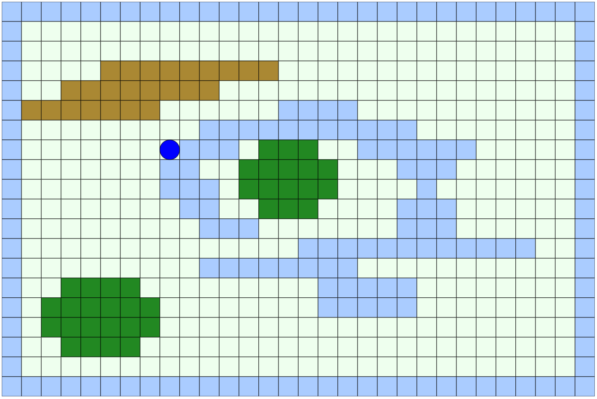

# Pathfinding-Visualizer

Simple 2D MMO game that allows multiple players to join and explore the world.
Players can traverse through all tiles equally but are not able to pass through
water tiles. Water tiles create a boundary for the 2D world.

## Simple 2D world

 - Blue tiles represent impassable water tiles
 - Green tiles represent passable forest tiles
 - Light green tiles represent passable grass tiles
 - Yellow/Brown tiles represent passable mountain tiles
 
 # Future of this project
 
 I plan to improve upon this project to enable a user to create a custom map. On top of this, a user
 will be able to add "weights" (speed of traversal through a tile) to create a weighted graph of tiles.
 Other features may include:
   - [ ] Additional tile types
   - [ ] Bigger map
   - [ ] Tasks/items for users to find together
   - [ ] Different colored players
